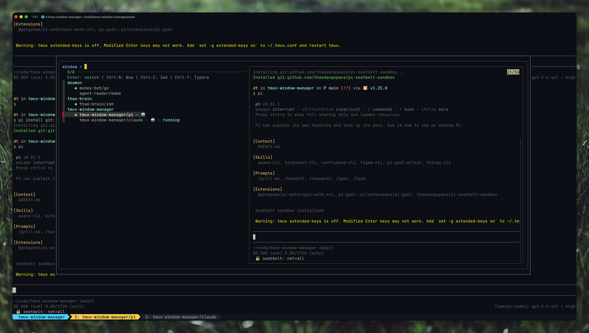
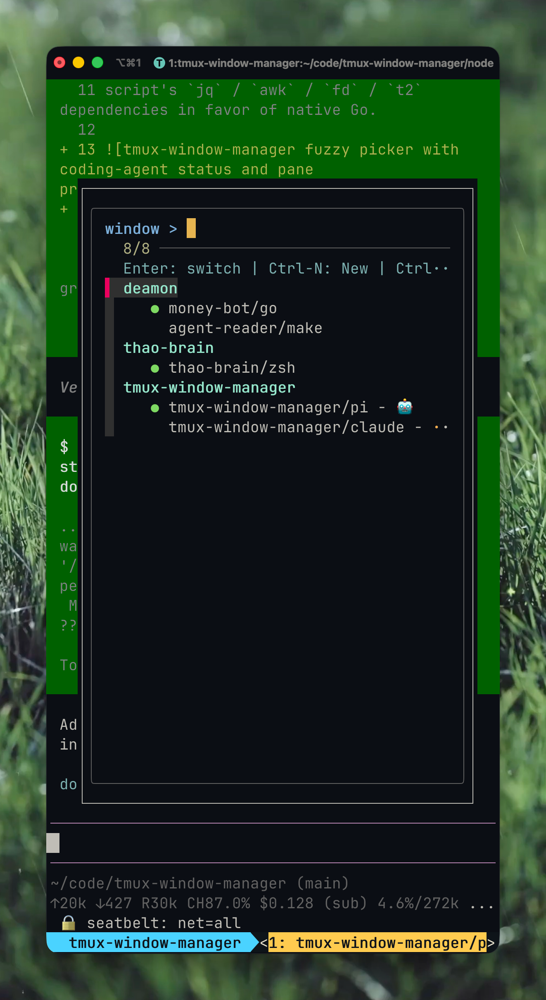

# tmux-window-manager

A fuzzy window switcher for tmux (`prefix + w`), as a self-contained Go binary
distributed as a [TPM](https://github.com/tmux-plugins/tpm) plugin. It lists
every window across all sessions, previews their panes, and badges windows
running coding agents (`claude` / `codex` / `pi`) — with a busy spinner and the
agent's model — all detected **natively**, with no external tools beyond `tmux`
and `fzf`.

It is a Go port of a personal `tmux_window_manager.sh` script; the port drops the
script's `jq` / `awk` / `fd` / `t2` dependencies in favor of native Go.



<p align="center">
  
  <br>
  <em>Responsive narrow layout with the pane preview hidden.</em>
</p>

## Features

- **Fuzzy picker** across all sessions, grouped by session with a live preview
  of each window's panes.
- **Event-driven agent status** — agents push their lifecycle state into a small
  SQLite DB via Claude Code / Codex hooks, so the picker badges each window as
  **working** (`⟳`), **waiting on you** (`🔔`, e.g. a permission prompt), or idle
  — no process polling or pane-scraping. Run `tmux-window-manager install-hooks`
  once to wire it up.
- **Optional Telegram notifications** — Claude can send a best-effort message
  when it needs input or finishes a turn, without a resident daemon.
- **Agent preview** — model and latest message, captured at hook time from
  Claude transcripts (`~/.claude/projects/**/*.jsonl`) and the Codex notify
  payload.
- **Ctrl-N** — create/attach a session in a directory you pick or type.
- **Ctrl-Z / Ctrl-T** — open Zed / Typora on the highlighted window's directory.
- **Ctrl-R** — reload the list (re-reads the latest status).
- **Status-bar label** — `tmux-window-manager label <pid> <fallback>` prints a
  pane's agent name for `window-status-format`.

## Requirements

- **tmux ≥ 3.2** (for `display-popup`)
- **fzf** — the picker UI
- **Go ≥ 1.25** — the plugin builds its binary on install (the pure-Go SQLite
  driver requires it; still cgo-free, no C toolchain needed)
- macOS or Linux

## Install (TPM)

Add to `~/.tmux.conf`:

```tmux
set -g @plugin 'thaodangspace/tmux-window-manager'
```

Then press `prefix + I`. TPM clones the repo and the plugin's `.tmux` hook builds
the binary (`go build`) on first run, rebuilding automatically when the source
changes. Press `prefix + w` to open the picker.

### Local install (no GitHub)

Point tmux at a local checkout instead of cloning:

```tmux
run-shell ~/code/tmux-window-manager/tmux-window-manager.tmux
```

This runs the same build-on-install hook and key binding.

### Build from source

```bash
go build -o bin/tmux-window-manager ./cmd/tmux-window-manager
```

## Documentation

The full user guide is an Astro/Starlight site under [`docs/`](docs/README.md).
Run it locally or build its static output with:

```bash
make docs-dev
make docs-build
```

The docs include picker controls, agent status setup, Telegram security details,
troubleshooting, and Cloudflare Pages deployment settings.

## Configuration

| Option        | Default | Purpose                                              |
|---------------|---------|------------------------------------------------------|
| `@twm_key`    | `w`     | Prefix key that opens the picker                     |
| `@twm_bin`    | (auto)  | Set by the plugin to the built binary path, so other config can call it |

Use `@twm_bin` to add the agent label to your status bar:

```tmux
setw -g window-status-format "#I: #(basename '#{pane_current_path}')/#(#{@twm_bin} label #{pane_pid} #{pane_current_command})"
```

## Commands

The binary re-invokes itself for its internal modes; you normally only bind
`run`, but all subcommands are usable:

| Command | Purpose |
|---------|---------|
| `run [client]` | Open the picker popup and switch to the selection |
| `list` | Emit the window rows fzf consumes |
| `preview <target>` | Render a window's panes |
| `label <pid> [fallback]` | Print a pane's agent name (status bar) |
| `open-editor <zed\|typora> <target>` | Open an editor on a window's path |
| `install-hooks [--claude] [--codex] [--dry-run]` | Wire status hooks into Claude Code / Codex |
| `hook [event]` | Record an agent lifecycle event and optionally notify Telegram |
| `status [--all]` | Dump the recorded agent status rows (debug) |

## Agent status setup

Run once to wire the hooks into Claude Code and print the Codex snippet:

```bash
tmux-window-manager install-hooks
```

This idempotently merges `SessionStart` / `UserPromptSubmit` / `Notification` /
`Stop` / `SessionEnd` hooks into `~/.claude/settings.json` (preserving your own
hooks) and prints a `notify = [...]` line to add to `~/.codex/config.toml`. From
then on, each agent reports its status as it works, and the picker reflects it.

## Telegram notifications (optional)

Create a Telegram bot and obtain the destination chat ID, then put both values
in `~/.config/twm.toml`:

```toml
[telegram]
bot_token = "<bot-token>"
chat_id = "<chat-id>"
```

Protect the file because it contains the bot token:

```bash
chmod 600 ~/.config/twm.toml
```

When `$XDG_CONFIG_HOME` is set, the file is read from
`$XDG_CONFIG_HOME/twm.toml` instead. Avoid putting the token in command
arguments, shell history, or tracked configuration files.

Environment variables remain supported and non-empty values override the
corresponding file fields:

```bash
export TWM_TELEGRAM_BOT_TOKEN='<bot-token>'
export TWM_TELEGRAM_CHAT_ID='<chat-id>'
claude
```

Environment values must be set before launching Claude because hooks inherit
that process's environment. The TOML file is read by each eligible hook, so file
changes do not require restarting Claude.

When both credentials are available, Claude sends MarkdownV2 notifications
with a plain summary line and bold detail labels for:

- `Notification`: `🔔 Claude needs input · <project>`, the session ID, the first
  user prompt, and the notification detail.
- `Stop`: `✅ Claude finished · <project>`, the session ID, and the first user
  prompt. Assistant response text is not sent.

The session ID and first user prompt are intentionally sent. Only the project
directory basename is included, not its full path; transcript files, assistant
responses, PIDs, model names, and credentials are excluded. Delivery happens
after a successful status DB write, is limited to two seconds, and has no retry
or background daemon.
Telegram errors never fail Claude Code or roll back status. Codex and Pi events
do not send Telegram notifications.

When the hook is running inside tmux and the pane is still live, the message
also includes an `Attach in tmux` link. This is a best-effort convenience for
Telegram Desktop and a browser running on the **same computer** as tmux:

- Clicking the link switches the most recently active existing tmux client to
  the exact originating pane; it does not launch or focus Ghostty and does not
  create a new terminal or SSH connection.
- The browser first loads an inert page and then submits a same-origin action;
  Telegram link previews cannot switch tmux. A visible form button remains as
  a JavaScript-disabled fallback.
- The link uses an opaque, single-use loopback token, expires after 15 minutes,
  and is served by a short-lived helper. No persistent listener or Telegram
  polling daemon is required.
- Missing tmux context, a dead pane, listener startup failure, or Telegram
  delivery failure removes only the link; the ordinary notification remains.
  A dead pane reports that the tmux session is no longer available.
- Links clicked from a phone or another computer cannot reach the tmux host's
  loopback listener. Attach targets, pane IDs, client names, paths, and host
  details are not included in the Telegram message or URL.

Both credentials are required, whether they come from the file, environment, or
a combination of the two. With neither configured, Telegram is silently
disabled; a partial configuration is skipped as an error. To disable it, remove
the `[telegram]` configuration and unset any overrides:

```bash
unset TWM_TELEGRAM_BOT_TOKEN TWM_TELEGRAM_CHAT_ID
```

For redacted delivery diagnostics, launch Claude with `TWM_HOOK_DEBUG=1` and
inspect `$TMPDIR/twm_hook.log`. The log reports only failure categories and does
not include the bot token, destination, response body, attach URL, token,
tmux target, or token-bearing URL.

## Notes

- **Status source.** Agent presence, name, model, and status all come from the
  status DB at `~/.local/state/tmux-window-manager/agents.db` (override with
  `$TWM_DB_PATH`; honors `$XDG_STATE_HOME`). Rows are keyed by working directory
  and carry the agent PID, so a crashed agent's badge clears automatically (its
  process is gone) even if no `SessionEnd` fired. An agent with no hooks
  installed simply shows no badge. Set `TWM_HOOK_DEBUG=1` to log redacted hook
  errors to `$TMPDIR/twm_hook.log`.
- The directory picker (`Ctrl-N`) does not honor `.gitignore` (the original
  relied on `fd` for that); explicit excludes cover `.git`, `node_modules`,
  `Library`, `.Trash`.

## License

MIT — see [LICENSE](LICENSE).
