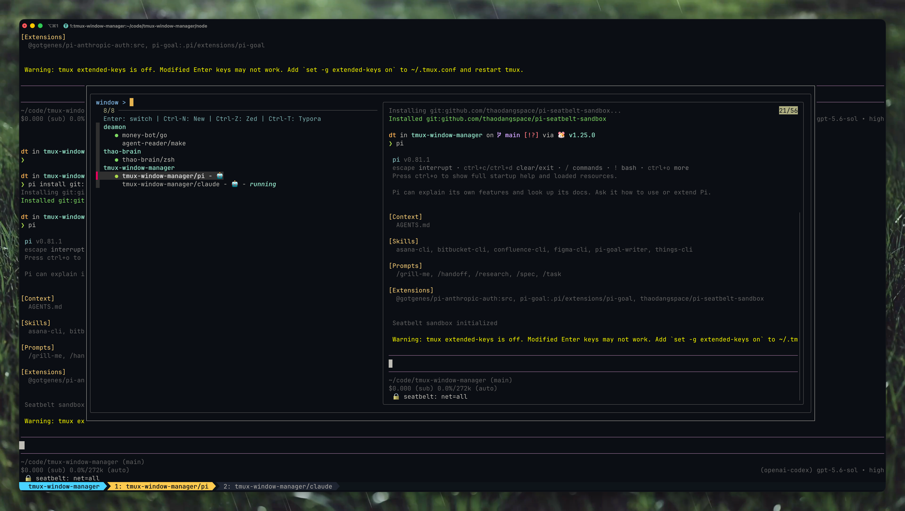
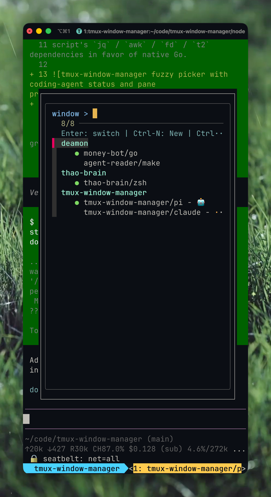

# tmux-window-manager

A fuzzy window switcher for tmux (`prefix + w`), as a self-contained Go binary
distributed as a [TPM](https://github.com/tmux-plugins/tpm) plugin. It lists
every window across all sessions, previews their panes, and badges windows
running coding agents (`claude` / `codex` / `pi`) — with a busy spinner and the
agent's model — all detected **natively**, with no external tools beyond `tmux`
and `fzf`.

It is a Go port of a personal `tmux_window_manager.sh` script; the port drops the
script's `jq` / `awk` / `fd` / `t2` dependencies in favor of native Go.



<p align="center">
  
  <br>
  <em>Responsive narrow layout with the pane preview hidden.</em>
</p>

## Features

- **Fuzzy picker** across all sessions, grouped by session with a live preview
  of each window's panes.
- **Event-driven agent status** — agents push their lifecycle state into a small
  SQLite DB via Claude Code / Codex hooks, so the picker badges each window as
  **working** (`⟳`), **waiting on you** (`🔔`, e.g. a permission prompt), or idle
  — no process polling or pane-scraping. Run `tmux-window-manager install-hooks`
  once to wire it up.
- **Persistent agents sidebar** — a narrow, always-visible left pane in every
  window, grouped by workspace (git root), showing every agent and its live
  status (`⋮ working`, `● waiting`, `✓ idle`). **On by default;** disable it in
  one line (see below).
- **Optional Telegram notifications** — best-effort messages only when an agent
  needs user input (`Notification`) or finishes a turn (`Stop`).
- **Agent preview** — model and latest message, captured at hook time from
  Claude transcripts (`~/.claude/projects/**/*.jsonl`) and the Codex notify
  payload.
- **Ctrl-N** — create/attach a session in a directory you pick or type.
- **Ctrl-X** — kill the highlighted row's session (if it is the one you are
  attached to, you are moved to another session first; the last session is
  never killed).
- **Ctrl-R** — reload the list (re-reads the latest status).
- **Status-bar label** — `tmux-window-manager label <pid> <fallback>` prints a
  pane's agent name for `window-status-format`.

## Requirements

- **tmux ≥ 3.2** (for `display-popup`)
- **fzf** — the picker UI
- **Go ≥ 1.25** — the plugin builds its binary on install (the pure-Go SQLite
  driver requires it; still cgo-free, no C toolchain needed)
- macOS or Linux

## Install (TPM)

Add to `~/.tmux.conf`:

```tmux
set -g @plugin 'thaodangspace/tmux-window-manager'
```

Then press `prefix + I`. TPM clones the repo and the plugin's `.tmux` hook builds
the binary (`go build`) on first run, rebuilding automatically when the source
changes. Press `prefix + w` to open the picker.

### Local install (no GitHub)

Point tmux at a local checkout instead of cloning:

```tmux
run-shell ~/code/tmux-window-manager/tmux-window-manager.tmux
```

This runs the same build-on-install hook and key binding.

### Build from source

```bash
go build -o bin/tmux-window-manager ./cmd/tmux-window-manager
```

## Documentation

The full user guide is an Astro/Starlight site under [`docs/`](docs/README.md).
Run it locally or build its static output with:

```bash
make docs-dev
make docs-build
```

The docs include picker controls, agent status setup, troubleshooting, and
Cloudflare Pages deployment settings.

## Configuration

| Option        | Default | Purpose                                              |
|---------------|---------|------------------------------------------------------|
| `@twm_key`    | `w`     | Prefix key that opens the picker                     |
| `@twm_bin`    | (auto)  | Set by the plugin to the built binary path, so other config can call it |

Use `@twm_bin` to add the agent label to your status bar:

```tmux
setw -g window-status-format "#I: #(basename '#{pane_current_path}')/#(#{@twm_bin} label #{pane_pid} #{pane_current_command})"
```

## Commands

The binary re-invokes itself for its internal modes; you normally only bind
`run`, but all subcommands are usable:

| Command | Purpose |
|---------|---------|
| `run [client]` | Open the picker popup and switch to the selection |
| `list` | Emit the window rows fzf consumes |
| `preview <target>` | Render a window's panes |
| `label <pid> [fallback]` | Print a pane's agent name (status bar) |
| `install-hooks [--claude] [--codex] [--dry-run]` | Wire status hooks into Claude Code / Codex |
| `hook [event]` | Record an agent lifecycle event (called from Claude/Codex hooks) |
| `status [--all]` | Dump the recorded agent status rows (debug) |
| `sidebar enable` / `disable` | Turn the persistent sidebar on/off at runtime |
| `sidebar toggle [-t window]` | Hide or show the sidebar in one window |
| `sidebar ensure` / `install` / `uninstall` | Reconcile / wire / remove the sidebar (usually automatic) |

## Agent status setup

Run once to wire the hooks into Claude Code and print the Codex snippet:

```bash
tmux-window-manager install-hooks
```

This idempotently merges `SessionStart` / `UserPromptSubmit` / `Notification` /
`Stop` / `SessionEnd` hooks into `~/.claude/settings.json` (preserving your own
hooks) and prints a `notify = [...]` line to add to `~/.codex/config.toml`. From
then on, each agent reports its status as it works, and the picker reflects it.

## Persistent agents sidebar

The plugin docks a narrow left pane in every window that lists the coding agents
running in each workspace (git root) with a live status glyph — `⋮ working`
(cyan), `● waiting` (yellow), `✓ idle` (green), `○ idle` (dim, no hook status).
It is **on by default** and refreshes about once a second while visible, doing
near-zero work while hidden. It never takes focus, never receives keystrokes, and
never appears in the picker's search or preview.

**To turn it off permanently**, add to `~/.config/twm.toml` (or
`$XDG_CONFIG_HOME/twm.toml`):

```toml
[sidebar]
enabled = false
```

**To turn it off for this tmux server** (until it restarts), run
`tmux-window-manager sidebar disable` (`sidebar enable` turns it back on). To hide
it in just the current window, run `tmux-window-manager sidebar toggle`.

Tune the width and refresh in the same `[sidebar]` block:

```toml
[sidebar]
width = 32          # columns, clamped 20..80 (capped at half the window)
refresh_ms = 1000   # clamped 500..10000
```

See the [sidebar guide](docs/src/content/docs/sidebar.md) for grouping,
troubleshooting, and known limits.

## Telegram notifications (optional)

Copy the included example and replace both values:

```bash
mkdir -p ~/.config
cp twm.toml.example ~/.config/twm.toml
chmod 600 ~/.config/twm.toml
```

```toml
[telegram]
bot_token = "<bot-token>"
chat_id = "<chat-id>"
```

TWM sends only `Notification` (needs input) and `Stop` (turn finished) events.
Delivery is best effort and never fails the agent hook. Environment variables
`TWM_TELEGRAM_BOT_TOKEN` and `TWM_TELEGRAM_CHAT_ID` can override the file.
Messages show the tmux `session:window`, model, current prompt, and turn
duration. Short turns and panes you are watching are skipped by default;
`include_response`, `min_turn_seconds`, and `skip_when_focused` tune this.
See the [Telegram guide](docs/src/content/docs/telegram.md) for details.

## Notes

- **Status source.** Agent presence, name, model, and status all come from the
  status DB at `~/.local/state/tmux-window-manager/agents.db` (override with
  `$TWM_DB_PATH`; honors `$XDG_STATE_HOME`). Rows are keyed by working directory
  and carry the agent PID, so a crashed agent's badge clears automatically (its
  process is gone) even if no `SessionEnd` fired. An agent with no hooks
  installed simply shows no badge. Set `TWM_HOOK_DEBUG=1` to log redacted hook
  errors to `$TMPDIR/twm_hook.log`.
- The directory picker (`Ctrl-N`) does not honor `.gitignore` (the original
  relied on `fd` for that); explicit excludes cover `.git`, `node_modules`,
  `Library`, `.Trash`.

## License

MIT — see [LICENSE](LICENSE).
